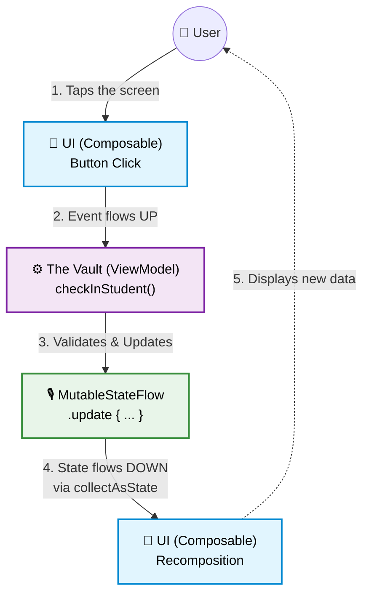

# 3. Under the Hood: Why Flow?

You survived the crash test. Your app's data is now safely stored in the **Vault** (the ViewModel) and survives screen rotations.

But if you look at the code from Lesson 2, you might have a burning question:
*"Why do we need `MutableStateFlow`, `asStateFlow`, and `collectAsStateWithLifecycle`?
Why can't I just write `var presentStudents = listOf<String>()` inside the ViewModel and be done with it?"*

It is a great question. In professional Android development  understanding **why** we use these
tools is just as important as knowing how to type them. Let's break it down.

---

## 1. The Photograph vs. The Live Stream

Why can't Jetpack Compose just read a standard Kotlin `var` or `List`?

Because Jetpack Compose is completely blind to standard variables changing.

| Feature | Standard Variable (`var`, `List`) | Reactive Stream (`StateFlow`) |
| :--- | :--- | :--- |
| **Metaphor** | 📸 **A Photograph** | 🎥 **A Live CCTV Stream** |
| **How UI sees it** | The UI looks once. If the data changes later, the UI has no idea. | The UI constantly watches the stream. When a new frame arrives, it reacts instantly. |
| **Use case** | Math calculations, static text. | User interfaces, database results, network states. |

If you put a standard `var name = "John"` in your ViewModel,
the UI will print "John" once. If the ViewModel later changes it to "Alice",
the UI will still say "John" because nobody told it to redraw.
**StateFlow** is the communication channel that forces the UI to redraw (recompose).

---

## 2. Inside the Vault: The "Backing Property" Pattern

If you look inside our `ClassroomViewModel`, you will notice a strange pattern.
We declare the state twice: once with an underscore `_` and once without it.

```kotlin
// 1. The Microphone (Private)
private val _uiState = MutableStateFlow(ClassroomState())

// 2. The Speaker (Public)
val uiState = _uiState.asStateFlow()
```

This is called **the Backing Property pattern**, and it is the golden standard in Kotlin architecture. We do this for security.
- `MutableStateFlow` (**The Microphone**): The word Mutable means "changeable".
This allows us to use the `.update {}` function to change the data.
It is marked as `private` because only the ViewModel should have the power to change the state.

- `StateFlow` (**The Speaker**): This is a read-only version of the stream.
It is public (`val`), so the UI can listen to it. But because it is not mutable, the UI cannot accidentally overwrite the data.

:::danger Why not make `MutableStateFlow` public?
If the UI could directly change the state, you break the **Unidirectional Data Flow (UDF)** pattern.
Your business logic becomes scattered across different UI components, making it impossible to track
where, when, or why the data changed.
The UI's only job is to display data and report events. The ViewModel's job is to securely validate and update the state.
:::


## 3. The Translator: `collectAsState`
So, the ViewModel is broadcasting our data using `StateFlow`. But Jetpack Compose doesn't speak "Flow".
Jetpack Compose speaks "State" (remember mutableStateOf from Lesson 1?).

We need a translator.

```kotlin

val state by viewModel.uiState.collectAsStateWithLifecycle()

```

- `collect`: Means "tune into this radio station and listen for updates."
- `AsState`: Translates the Kotlin Coroutines `Flow` into Jetpack Compose State so the UI can draw it.
- `WithLifecycle`: This makes your app incredibly smart. If the user minimizes your app to answer a text message,
this function automatically stops listening to the stream, saving battery and CPU. When the user comes back, it resumes automatically.


## The Cheat Sheet

Here is your quick reference guide for modern Android State Management.
Keep these concepts in mind whenever you are building the communication bridge between your UI and the ViewModel.

| Tool | Where does it live? | What does it do? | Metaphor |
| :--- | :--- | :--- | :--- |
| **`MutableStateFlow`** | ViewModel (`private`) | Holds and safely updates the actual data. | 🎙️ The Radio DJ's microphone. |
| **`StateFlow`** | ViewModel (`public`) | Exposes a read-only stream to the outside world. | 📻 The public radio frequency. |
| **`collectAsState...`** | UI (`@Composable`) | Translates the stream into visual UI updates. | 🚗 The radio receiver in your car. |

:::tip The Golden Rule of Architecture: UDF
**State flows down, events flow up.**
The ViewModel pushes the `uiState` *down* to the Composable.
The Composable sends user events (clicks, typing) *up* to the ViewModel.
They never cross paths in the middle. This is the essence of **Unidirectional Data Flow**.


(*UDF* Unidirectional Data Flow)
:::

-------
# Metaphors


## Metaphor 1: The Newspaper vs. The Live Radio
* **Standard Variable (`List`, `String`): The Newspaper.**
When you read a newspaper, the news is fixed at the time of printing.
If a major event happens five minutes later, your newspaper doesn't change.
You have to manually go and buy a new edition (this is called **Pulling** data).
* **`Flow` / `StateFlow`: The Live Radio.** You just tune in and listen.
The moment an event happens, the DJ announces it and it reaches your ears immediately without you doing anything.
The data is pushed to you (**Pushing** data).


## Metaphor 2: The Bucket vs. The Garden Hose
* **Standard Variable (`List`, `String`): The Bucket.** A bucket holds a fixed amount of water.
If it's empty, or if you need more, you have to actively walk back to the well and fetch it yourself.
* **`Flow` / `StateFlow`: The Garden Hose.** The data is like water connected directly to the main supply.
You just open the nozzle (by calling `.collectAsState()`) and the water streams continuously whenever the tap is turned on.


### Metaphor 3: The Dipstick vs. The Dashboard Light
* **Standard Variable (`List`, `String`): The Oil Dipstick.**
Your engine might be losing oil, but you won't know unless you manually stop the car,
open the hood, and check the dipstick. You have to actively ask for the state.
* **`Flow` / `StateFlow`: The Dashboard Warning Light.** The car's computer (the `ViewModel`) constantly monitors the engine.
The moment the oil pressure drops, it immediately lights up the red icon on your dashboard (the UI). You are notified instantly.


## The Big Picture: Unidirectional Data Flow

If you ever feel lost debugging your app, come back to this diagram. This is the exact journey of a single piece of data, from the moment the user taps the screen to the moment the UI redraws itself.

Notice the loop: **Events flow UP** (blue to purple), and **State flows DOWN** (green back to blue).

