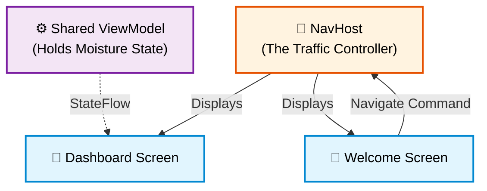

# 5. Real-World Simulation: Building with Navigation

Until now, we have provided you with finished code and explained how it works (Top-Down).
Today, we change the rules. You are no longer just a student; you are a Software Developer.

We will simulate a real-world scenario (Down-Top approach). We will start with a client's request,
design the architecture, and then write the code step by step.
This project will also introduce the missing piece of our architecture: **Jetpack Navigation Compose**.

---

## Phase 1: The Client Brief (Requirements)

**Client:** "GreenThumb Automations"
**Project:** A companion app for their new IoT soil moisture sensor.

**The Requirements:**
1.  **Welcome Screen:** A simple screen with a welcoming logo/text and a button that says "Start Monitoring".
2.  **Dashboard Screen:** When the user clicks the button, they should be taken to the Dashboard.
Here, they can see the current moisture level (simulated by a `Slider` for now).
3.  **Data Persistence:** If the user sets the moisture to 80% on the Dashboard, goes *back* to the Welcome Screen,
and enters the Dashboard again, the moisture must still be at 80%.
4.  **No physical back button crashes:** The app must handle standard Android back-button navigation correctly.

---

## Phase 1.5: The Use Cases (User Journey)

Before we start mapping out our screens, let's look at the **Use Cases**.
A use case is a step-by-step scenario showing how a user interacts with our app.
This helps us understand how data must flow behind the scenes.

### Use Case 1: The Happy Path (First Launch)
* **Actor:** User
* **Scenario:**
1. The user opens the app and sees the **Welcome Screen**.
2. The user clicks the **"Start Monitoring"** button.
3. The app routes them to the **Dashboard Screen**.
4. The user sees the default moisture level set to **50%**.

### Use Case 2: Data Persistence (The Core Requirement)
* **Actor:** User
* **Scenario:**
1. While on the **Dashboard Screen**, the user drags the slider to **80%**.
2. The user presses the Android system **Back Button**.
3. The app safely returns them to the **Welcome Screen**.
4. The user clicks **"Start Monitoring"** again.
5. The **Dashboard Screen** opens and must immediately display **80%** (not the default 50%).

### Use Case 3: The Rotation Test (The Bulletproof Vault)
* **Actor:** User / Environment
* **Scenario:**
1. The user is on the **Dashboard Screen** looking at the slider.
2. The user rotates their phone to landscape mode.
3. The Android system destroys and recreates the UI.
4. The slider must remain exactly where the user left it without resetting or crashing.

:::tip Why write Use Cases?
Looking at *Use Case 2* and *3*, we can clearly see that the Dashboard Screen cannot be the "owner" of the moisture data.
If it were, leaving the screen or rotating the phone would destroy the data.
The data *must* live outside the screens—in a Shared ViewModel.

---

:::
## Phase 2: The Architecture Design

Before we write a single line of UI, we must plan the data logistics (Our 4W2H Framework).

### The Problem with Navigation
In Jetpack Compose, changing screens isn't about opening new Activities.
It's simply about swapping out which `@Composable` function is currently visible.

If the Welcome Screen and the Dashboard Screen each have their own local `remember` state,
the moment you navigate away from the Dashboard, its state is destroyed. When you return, the moisture resets to 0.

### The Solution: The Shared Vault
To fulfill Requirement #3 (Data Persistence across screens), we cannot put the `ViewModel` inside the Dashboard Composable.
We must create a **Shared ViewModel** that lives *above* the navigation layer.


---

## Phase 3: Implementation Step-by-Step

:::info Dependencies (Version Catalogs)
To use Navigation Compose, we need to add its dependency using the modern TOML file approach.

**1. Open `gradle/libs.versions.toml`**
Add the version and the library definition in their respective sections:
```toml
[versions]
navigationCompose = "2.7.7" # or the latest version

[libraries]
androidx-navigation-compose = { group = "androidx.navigation", name = "navigation-compose", version.ref = "navigationCompose" }

```
2. Open build.gradle.kts (Module :app)
Add the library inside your `dependencies { ... }` block and click Sync Now:
```kotlin

implementation(libs.androidx.navigation.compose)

```


:::

:::tip The TOML "Phonebook" Metaphor
A `.toml` file (in the context of Gradle Version Catalogs) is essentially your project's **phonebook for libraries**.

Instead of memorizing and manually typing a long "phone number" (like version `2.7.7`) into every single configuration file,
you save it just once in the `.toml` file and assign it a friendly nickname (an alias).

* **Without `.toml` (The Old Way):** You hardcode specific version numbers manually in every single build file.
When a library receives an update, you have to hunt through your entire project and replace those numbers in dozens of different places.
* **With `.toml` (The Modern Way):** You save the number in your address book.
In your main build script, you simply say: *"Connect the Navigation library"* (`libs.androidx.navigation.compose`). When a new version comes out, you change the digits in exactly one place—the phonebook—and the entire application instantly starts using the updated version.

It is a centralized control center that keeps your project perfectly organized and easy to maintain.
:::


### Step 1: The Routes
First, we need to define the "addresses" of our screens.
In Navigation Compose, routes are usually defined as strings or sealed classes.

```kotlin
// Define our screen addresses
sealed class Screen(val route: String) {
    object Welcome : Screen("welcome")
    object Dashboard : Screen("dashboard")
}

```


### Step 2: The ViewModel (The Vault)
We create our ViewModel exactly like in the previous lesson. It holds the moisture level.
Create `SensorViewModel.kt` and add the following code:

```kotlin
import androidx.lifecycle.ViewModel
import kotlinx.coroutines.flow.MutableStateFlow
import kotlinx.coroutines.flow.asStateFlow
import kotlinx.coroutines.flow.update

class SensorViewModel : ViewModel() {
    private val _moisture = MutableStateFlow(50f) // Default 50%
    val moisture = _moisture.asStateFlow()

    fun setMoisture(value: Float) {
        _moisture.update { value }
    }
}
```

---

## Deep Dive: Decoding the ViewModel

To fully understand this code, you need to know *what* it is, *why* we use it, and *where* it comes from.

**Click on any line of code below to reveal its internal logic:**

<details>
    <summary><strong>1. <code>class SensorViewModel : ViewModel()</code></strong></summary>

    *   **What is it?** We are creating a class that extends (inherits from) the Android Architecture `ViewModel`.
    *   **Why?** A standard Kotlin class is destroyed when the phone rotates. A `ViewModel` is special: the Android OS keeps it alive in memory even when the Activity is destroyed and recreated.
    *   **The Metaphor:** It is a **shock-proof bunker** outside your fragile UI building.

</details>

<details>
    <summary><strong>2. <code>private val _moisture = MutableStateFlow(50f)</code></strong></summary>

    *   **What is it?** This is our "internal" data stream starting at `50f` (50% moisture).
    *   **Why a "Stream" instead of a standard variable?** A stream is like a pipe. When you push a new value into it, that value flows automatically to anyone listening, allowing the UI to react instantly.
    *   **Why `StateFlow`?** It always holds a current value (like a thermostat) and drops duplicate events (saving CPU and battery).
    *   **Why is it `private`?** Because of **Encapsulation**. We do not want the UI to directly overwrite this value with corrupted data (e.g., `-999f`).
    *   **The Metaphor:** This is the **microphone inside the radio booth**. Only the DJ (the ViewModel) can speak into it.

</details>

<details>
    <summary><strong>3. <code>val moisture = _moisture.asStateFlow()</code></strong></summary>

    *   **What is it?** This is our "public", read-only stream.
    *   **Why do we have two variables for the same data?** This is the **Backing Property** pattern. The outside world can see the public `moisture`, but they cannot change it because it is read-only.
    *   **The Metaphor:** This is the **radio frequency (the speakers on the street)**. Anyone can listen, but nobody on the street can scream into the speakers to alter the broadcast.

</details>

<details>
    <summary><strong>4. <code>fun setMoisture(value: Float)</code></strong></summary>

    *   **Where does it come from?** The `value` is passed directly from the UI when the user drags the `Slider`.
    *   **Why `.update { }` instead of `.value = value`?** `.update { }` is **thread-safe (atomic)**. If multiple background tasks try to modify the moisture at the exact same millisecond, `.update` ensures every single change is processed in a perfect queue without data loss.
    *   **The Metaphor:** This is the **request hotline** for the radio station. The listener calls the DJ to request a song, and the DJ updates the broadcast safely.

</details>

---


:::tip Coming Up Next: What are Coroutines?
You might notice that `MutableStateFlow` and `.update {}` come from a library called `kotlinx.coroutines`.

**Coroutines** are Kotlin's way of doing **asynchronous programming** (running tasks in the background).
* **The Problem:** If your app downloads data from the internet or reads a heavy file on the main thread,
the UI freezes, lags, and crashes.
* **The Coroutine Solution:** A coroutine is like a lightweight, ultra-efficient background worker.
It can pause its work, step aside, wait for a network response, and resume—all without blocking the UI.

Right now, our `StateFlow` is a continuous pipeline built on top of this coroutine system.
Later, when we connect our app to a real database over Wi-Fi, we will launch our own coroutines to handle the heavy lifting!
:::


### Step 3: The Screens (The UI)
Notice that our screens do not create the ViewModel themselves.
They either receive the `NavController` (to change screens) or the `ViewModel` (to read data) as parameters.
Create `WelcomeScreen.kt` and add the following code:

```kotlin
import androidx.compose.foundation.layout.*
import androidx.compose.material3.*
import androidx.compose.runtime.*
import androidx.compose.ui.Alignment
import androidx.compose.ui.Modifier
import androidx.compose.ui.unit.dp
import androidx.navigation.NavController


@Composable
fun WelcomeScreen(navController: NavController) {
    Column(
        modifier = Modifier.fillMaxSize(),
        verticalArrangement = Arrangement.Center,
        horizontalAlignment = Alignment.CenterHorizontally
    ) {
        Text("Welcome to GreenThumb", style = MaterialTheme.typography.headlineMedium)
        Spacer(modifier = Modifier.height(24.dp))
        Button(
            onClick = {
                // Navigate to Dashboard
                navController.navigate(Screen.Dashboard.route)
            }
        ) {
            Text("Start Monitoring")
        }
    }
}
```

Create `DashboardScreen.kt` and add the following code:

```kotlin
@Composable
fun DashboardScreen(viewModel: SensorViewModel) {
    val moisture by viewModel.moisture.collectAsStateWithLifecycle()

    Column(
        modifier = Modifier.fillMaxSize().padding(32.dp),
        verticalArrangement = Arrangement.Center,
        horizontalAlignment = Alignment.CenterHorizontally
    ) {
        Text("Soil Moisture: ${moisture.toInt()}%", style = MaterialTheme.typography.titleLarge)
        Spacer(modifier = Modifier.height(24.dp))
        Slider(
            value = moisture,
            onValueChange = { viewModel.setMoisture(it) },
            valueRange = 0f..100f
        )
    }
}

```

### Step 4: The Traffic Controller (NavHost)
Finally, we tie it all together. We create the `NavController` and the `ViewModel` at the very top level.
Then, we use a `NavHost` to act as the traffic controller, deciding which screen is displayed based on the current route.

Create `GreenThumbApp.kt` and add the following code:
```kotlin
import androidx.compose.runtime.Composable
import androidx.lifecycle.viewmodel.compose.viewModel
import androidx.navigation.compose.NavHost
import androidx.navigation.compose.composable
import androidx.navigation.compose.rememberNavController

@Composable
fun GreenThumbApp(modifier: Modifier = Modifier) {
    // 1. Create the Traffic Controller
    val navController = rememberNavController()

    // 2. Create the Shared Vault (ViewModel)
    // Because it is created here, it survives as long as GreenThumbApp is active
    val sharedViewModel: SensorViewModel = viewModel()

    // 3. Set up the Navigation Map
    NavHost(
        navController = navController,
        startDestination = Screen.Welcome.route, // Where does the app start?
        modifier = modifier
    ) {

        // Map Route A to Screen A
        composable(route = Screen.Welcome.route) {
            WelcomeScreen(navController = navController)
        }

        // Map Route B to Screen B
        composable(route = Screen.Dashboard.route) {
            DashboardScreen(viewModel = sharedViewModel)
        }
    }
}
```

---

## Deep Dive: Decoding the Navigation Hub

`GreenThumbApp` is the traffic controller of your entire application. It doesn’t draw buttons or text itself; instead, it decides **which screen should be active** and **how data is shared** between them.

**Click on any line of code below to reveal its internal machinery:**

<details>
    <summary><strong>1. <code>val navController = rememberNavController()</code></strong></summary>

    *   **What is it?** This creates the `NavController`, which is the central engine of the Jetpack Navigation library. We wrap it in `remember` so that Android doesn't accidentally reset our navigation history when the UI redraws.
    *   **Why do we need it?** It keeps track of the **Back Stack** (the history of screens the user visited). Without it, if the user pressed the system back button, the app wouldn't know where to return and would simply close.
    *   **The Metaphor:** This is the **GPS / Steering Wheel** of your car. It knows exactly where you are right now and remembers the road you took to get here.

</details>

<details>
    <summary><strong>2. <code>val sharedViewModel: SensorViewModel = viewModel()</code></strong></summary>

    *   **What is it?** We are creating our `SensorViewModel` instance at the very top level of our application, *above* the navigation layer.
    *   **Why is it positioned here?** This is the secret to **Data Persistence**. In Jetpack Compose, when you navigate away from a screen, that screen is completely destroyed to save memory.
    * If we created the ViewModel *inside* `DashboardScreen`, leaving the dashboard would kill the ViewModel and erase the moisture data.
    * Because we create it here, in the parent `GreenThumbApp`, the ViewModel lives happily in memory as long as the entire app is running. We then simply pass it down to whichever screen needs it.
    *   **The Metaphor:** This is a **Central Cloud Storage / Shared Safe**. Instead of giving each room (screen) its own private notebook, we put a giant whiteboard in the main hallway. Every room can walk out, read from it, or write to it.

</details>

<details>
    <summary><strong>3. <code>NavHost(..., modifier = modifier)</code></strong></summary>

    *   **What is it?** The `NavHost` is a container that acts as a placeholder where your actual screens will be swapped in and out.
    *   **Why do we pass the <code>modifier</code> parameter to it?** Look at the parent `Scaffold` in your `MainActivity`. It measures the phone's screen and calculates `innerPadding` so your UI doesn't hide behind the camera notch or the system status bar. By passing `modifier = modifier` down to the `NavHost`, we are telling our navigation container: *"Hey, respect the phone's safe margins and shrink yourself to fit perfectly inside the Scaffold!"*
    *   **The Metaphor:** This is the **Theater Stage**. The actors (your screens) will walk onto this specific stage one by one. The `modifier` sets the physical boundaries and size of that stage.

</details>

<details>
    <summary><strong>4. <code>composable(route = Screen.Welcome.route) {"{ ... }"}</code></strong></summary>

    *   **What is it?** These are your **Navigation Routes**. You are building a map for the `NavHost` by linking a unique String address (the route) to an actual Composable screen.
    *   **How does the handoff work?**
    * For the **Welcome Screen**, we pass the `navController` because that screen needs to execute a command: *"Take me to the dashboard!"* (`navController.navigate()`).
    * For the **Dashboard Screen**, we pass the `sharedViewModel` because that screen doesn't care about changing screens; it only cares about reading and updating the moisture level.
    *   **The Metaphor:** This is your **Address Book / Web URL router**. You are telling the app: *"If the current address points to 'welcome', call the WelcomeScreen function. If it points to 'dashboard', call the DashboardScreen function."*

</details>


---


## Architectural Summary: The 4W2H Matrix


To fully master this project before we move forward, let's look at the **GreenThumb** application through our **Compose Matrix**.
This framework forces you to map architectural questions to specific Jetpack Compose tools.

| Dimension | Question | The GreenThumb Implementation |
| :--- | :--- | :--- |
| **0. WHAT** | Data Type | Simple `Float` for moisture. Navigation addresses use a `sealed class`. |
| **1. WHERE** | Storage | `ViewModel` instantiated at the `NavHost` level to prevent data loss during screen swaps. |
| **2. WHEN** | Processing | `Column` (Eager) — we have a static, simple UI with no long lists requiring `LazyColumn`. |
| **3. WHO** | Data Flow | `StateFlow` (Push) — the ViewModel actively pushes continuous slider updates down to the UI. |
| **4. HOW** | Reactivity | `State<T>` — achieved by converting our flow using `collectAsStateWithLifecycle()`. |
| **5. HOW LONG** | Lifecycle | `ViewModel` scope (survives rotation and navigation). `NavController` is held by `remember`. |

:::note Key Takeaway
Whenever you build a new feature, run it through this matrix.
Choosing between a simple `@Composable` variable and a `ViewModel` (the **WHERE**) or between `remember`
and `Datastore` (the **HOW LONG**) will dictate how robust your app is against crashes and data loss.
:::


